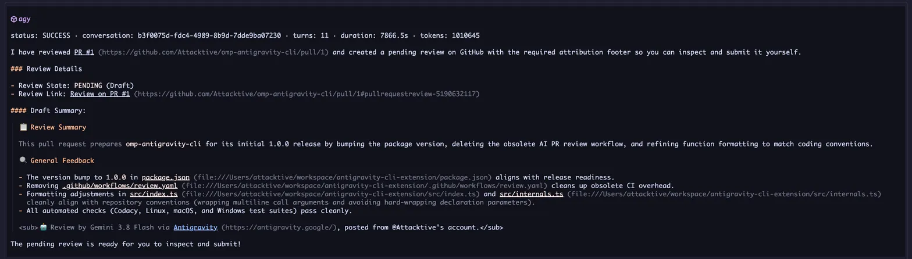

# omp-antigravity-cli

An unofficial [OMP](https://oh-my-pi.dev) plugin that delegates tasks and slash commands to the Antigravity CLI (`agy`).



> [!NOTE]
> This plugin is no better than using the official `agy` harness.
> It does not make Antigravity faster, smarter, or magically enhanced.
> It delegates directly to the underlying `agy` command-line executable.
> This plugin is built for developers who dislike using the official `agy` harness and prefer staying inside their OMP environment without switching tools.

## Requirements

- The Antigravity CLI (`agy`) installed and accessible on `PATH` (or pointed to via `PI_AGY_BIN`).
- An authenticated Antigravity account (ensure running `agy` in your terminal succeeds).

## Installation

### Local checkout (development)

Link the local repository directly:

```bash
omp plugin link /path/to/omp-antigravity-cli
```

This creates a symlink into `~/.omp/plugins/node_modules/omp-antigravity-cli`, allowing local changes to take effect immediately on the next launch.

### From GitHub

```bash
omp plugin install github:Attacktive/omp-antigravity-cli
```

### From NPM

```bash
omp plugin install omp-antigravity-cli
```

To verify the installation:

```bash
omp plugin list
```

To remove the plugin:

```bash
omp plugin uninstall omp-antigravity-cli
```

## Features

### 1. Slash Command (`/agy`)

Delegate prompts directly to `agy` from your OMP chat console:

```text
/agy Inspect this codebase and identify memory leaks
```

Progress is streamed live to a rolling status widget above your editor:

```text
agy: step 3 · 4s · run_command · bun test
```

#### Flags

- **Continue previous conversation (default)**: Consecutive `/agy` commands continue the same conversation thread automatically.
- **Model (default)**: If `--model` is omitted, the plugin lets `agy` choose its configured default model.
- **Execution mode (default)**: If `--plan` is omitted, the plugin runs `agy` in its normal mode; `--mode plan` is passed only with `--plan`.
- **`--new`**: Force a new conversation session instead of resuming:
  ```text
  /agy --new Start fresh analysis
  ```
- **`--plan`**: Run in read-only plan mode without making any workspace modifications:
  ```text
  /agy --plan Suggest an architectural refactor for auth
  ```
- **`--model <id>`**: Use a specific model available in `agy`:
  ```text
  /agy --model gemini-3.8-flash-high Run quick diagnostics
  /agy --model claude-opus-4-6-thinking Perform deep reasoning refactoring
  ```
- **`--resume <id>`**: Explicitly resume a prior conversation by its ID:
  ```text
  /agy --resume 3e4b7c12-8f90-4a1b-98cd-123456789abc Continue the previous task
  ```
- **`--stop`**: Immediately cancel all running `agy` executions:
  ```text
  /agy --stop
  ```

### 2. Agent Tool (`agy`)

The primary coding agent can also delegate self-contained sub-tasks to `agy` as a tool:

- Offloads tasks onto your Antigravity subscription to conserve primary model tokens.
- Obtains second opinions or parallel explorations from different model families.
- Automatically handles permissions (`--dangerously-skip-permissions`) and bounds file operations to the current workspace (`--add-dir`).

#### Parameters

| Parameter | Type | Required | Description |
| :--- | :--- | :--- | :--- |
| `prompt` | `string` | Yes | Self-contained task instructions, goals, and acceptance criteria. |
| `model` | `string` | No | Target model ID (e.g. `gemini-3.8-flash-high`, `claude-opus-4-6-thinking`). |
| `conversation` | `string` | No | Previous conversation ID to continue an existing session. |
| `plan` | `boolean` | No | Run in read-only plan mode without file edits. |

## Environment Variables

| Variable | Default | Description |
| :--- | :--- | :--- |
| `PI_AGY_TIMEOUT` | `900` | Wall-clock timeout in seconds handed to `agy --print-timeout`. |
| `PI_AGY_BIN` | `agy` | Custom path or executable name for the `agy` binary. |

## Development

Run tests, typechecks, and linters:

```bash
bun install
bun test
bun run typecheck
bun run lint
```

## License

[MIT](LICENSE)
